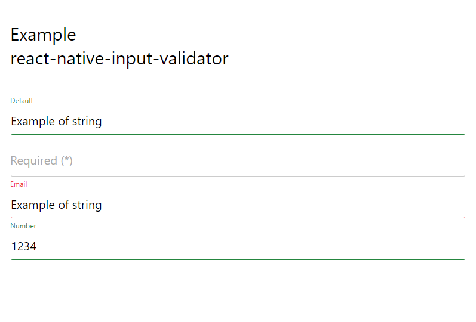

# React Native Input Validator

## `react-native-input-validator`

_Compatible with: Android, iOS, Windows, Web and Expo_

[![NPM version][npm-image]][npm-url]
[![npm download][download-image]][download-url]
[](http://standardjs.com/)

[npm-image]: http://img.shields.io/npm/v/react-native-input-validator.svg?style=flat-square
[npm-url]: http://npmjs.org/package/react-native-input-validator
[download-image]: https://img.shields.io/npm/dm/react-native-input-validator.svg?style=flat-square
[download-url]: https://npmjs.org/package/react-native-input-validator

**Github:** https://github.com/marcocesarato/react-native-input-validator

**Author:** Marco Cesarato

## 📘 Description

This library validates strings and number passed on TextInput component and highlight the result (valid green, invalid red).

## 🎨 Screenshots



## 📖 Install

Just run the following command line:

### npm

```shell
npm install react-native-input-validator --save
```

### Yarn

```shell
yarn add react-native-input-validator
```

## 💻 Usage

### Require

```javascript
import TextInput from "react-native-input-validator";
```

### Examples

#### Placeholder floating label

```javascript
// Import
import TextInput from "react-native-input-validator";
```

```javascript
// Example
<InputValidator
	onRef={(r) => {
		this.input = r;
	}}
	type="email"
	value={this.state.value}
	style={styles.input}
	onChangeText={(text) => {
		this.setState({value: text});
	}}>
	<Text>Default</Text>
</InputValidator>
```

```javascript
// Check Validation
this.input.isValidated(); // Faster: Check validation state
this.input.isValid(); // Alternative safer: Validate and check validation state
```

#### Only text input

```javascript
// Import
import TextInput from "react-native-input-validator";
```

```javascript
// Example
<InputText
	onRef={(r) => {
		this.input = r;
	}}
	type="email"
	value={this.state.value}
	style={styles.input}
	onChangeText={(text) => {
		this.setState({value: text});
	}}
/>
```

```javascript
// Check Validation
this.input.isValidated(); // Faster: Check validation state
this.input.isValid(); // Alternative safer: Validate and check validation state
```

## ⚡️ Run example

Clone or download repo and after:

```shell
cd Example
yarn install # or npm install
expo start
```

Open Expo Client on your device. Use it to scan the QR code printed by `expo start`. You may have to wait a minute while your project bundles and loads for the first time.

## 📘 Types

- email
- phone
- url
- currency
- postal-code
- hex-color
- identity-card
- credit-card
- numeric
- integer | int
- real | float
- decimal
- alpha
- alphanumeric

## 💡 Props

### Handlers

Same of `TextInput` like `onChangeText` etc...
Read more here: https://facebook.github.io/react-native/docs/textinput.html

| Additional Handlers | Description                         | Type     | Default | Note                          |
| ------------------- | ----------------------------------- | -------- | ------- | ----------------------------- |
| onRef               | Reference of the TextInput instance | Function |         | Important for validate fields |

### Methods

Same of `TextInput` like `focus()`, `clear()`, `blur()` etc...
Read more here: https://facebook.github.io/react-native/docs/textinput.html

| Additional Methods | Description                                            | Type | Default | Note |
| ------------------ | ------------------------------------------------------ | ---- | ------- | ---- |
| isValidated        | Check if state of TextInput is valid                   | Bool |
| isValid            | Validate the TextInput and return the validation state | Bool |

### Props

Same of `TextInput` like `editable`, `autoFocus` etc...
Read more here: https://facebook.github.io/react-native/docs/textinput.html

| Additional Property | Description                                                                                  | Type   | Default   | Note                                                                                                                                                                                                                                                                                                                                                                                                                                                                                     |
| ------------------- | -------------------------------------------------------------------------------------------- | ------ | --------- | ---------------------------------------------------------------------------------------------------------------------------------------------------------------------------------------------------------------------------------------------------------------------------------------------------------------------------------------------------------------------------------------------------------------------------------------------------------------------------------------- |
| type                | Type of input                                                                                | String | `dafault` |                                                                                                                                                                                                                                                                                                                                                                                                                                                                                          |
| symbol              | Symbol for `currency` type                                                                   | String |           |                                                                                                                                                                                                                                                                                                                                                                                                                                                                                          |
| locale              | For better validation can be useful for some type like `postal-code`, `identity-card` etc... | String |           | Locale is one of `['ar', 'ar-AE', 'ar-BH', 'ar-DZ', 'ar-EG', 'ar-IQ', 'ar-JO', 'ar-KW', 'ar-LB', 'ar-LY', 'ar-MA', 'ar-QA', 'ar-QM', 'ar-SA', 'ar-SD', 'ar-SY', 'ar-TN', 'ar-YE', 'bg-BG', 'cs-CZ', 'da-DK', 'de-DE', 'el-GR', 'en-AU', 'en-GB', 'en-HK', 'en-IN', 'en-NZ', 'en-US', 'en-ZA', 'en-ZM', 'es-ES', 'fr-FR', 'hu-HU', 'it-IT', 'ku-IQ', 'nb-NO', 'nl-NL', 'nn-NO', 'pl-PL', 'pt-BR', 'pt-PT', 'ru-RU', 'sl-SI', 'sk-SK', 'sr-RS', 'sr-RS@latin', 'sv-SE', 'tr-TR', 'uk-UA']` |

### Props Styles

| Property       | Description               | Type   | Default | Note                        |
| -------------- | ------------------------- | ------ | ------- | --------------------------- |
| style          | Input style               | Object |         |                             |
| labelStyle     | Label Style (placeholder) | Object |         | Only using `InputValidator` |
| containerStyle | Container Style           | Object |         | Only using `InputValidator` |
| validStyle     | Input Style when valid    | Object |         |
| invalidStyle   | Input Style when invalid  | Object |         |

## 🤔 How to contribute

Have an idea? Found a bug? Please raise to [ISSUES](https://github.com/marcocesarato/react-native-input-validator/issues).
Contributions are welcome and are greatly appreciated! Every little bit helps, and credit will always be given.
